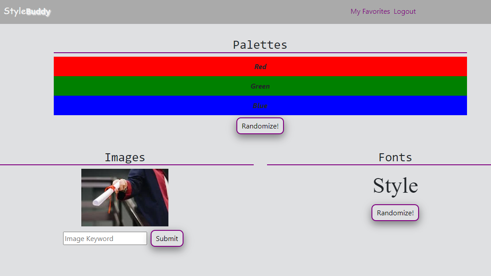
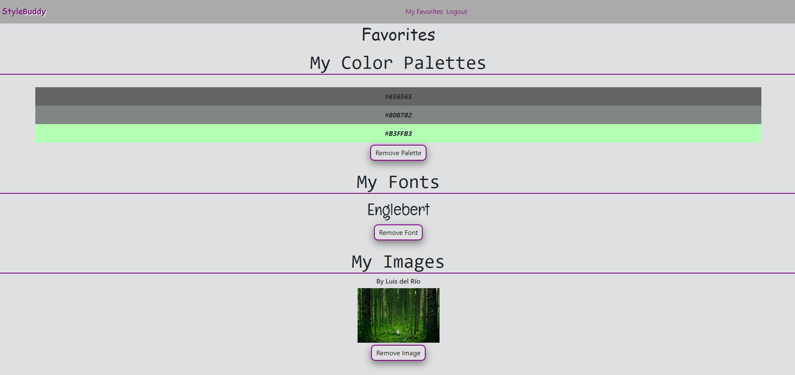
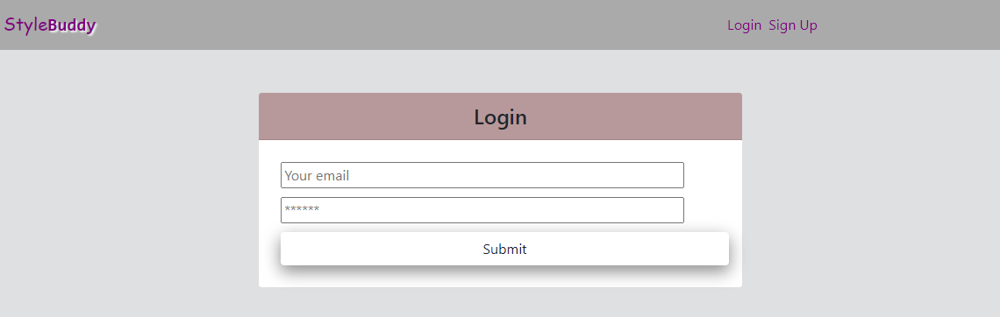
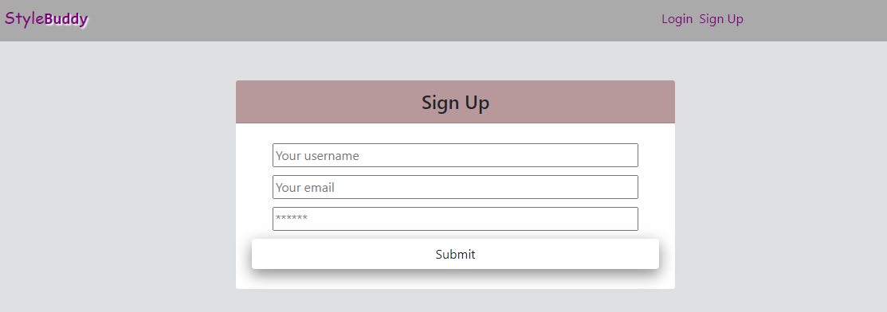

# Style-Buddy

## Description
Style-buddy is a one-stop shop for developers who need styling ideas for their project. Style-buddy will provide an array of beautiful color palettes, randomized fonts from the Google Font API for inspiration, and a library of 1000s of stock images that are free to use. Users will be able to create an account for free and save images, color palettes, and fonts they like to their favorites page.
 
 
The application is built using a React front end. Data is managed through the use of GraphQL and MongoDB. Server functionality is provided by Node.js and Express.js. User authentication is handled through JWT. Styling was done using a combination of Bootstrap and standard CSS. The application is deployed currently useing Heroku with Atlas DB. Client dependencies include: apollo, react, boostrap, graphql, jwt-decode, pexels, and webfontloader. Server side dependencies include: bcrypt, express, graphql, jsonwebtoken, mongoose, and apollo-server-express. 

## Table of Contents
[Description](#description) 
[Installation](#installation) 
[Usage](#usage) 
[Credits](#credits) 

## Installation
No installation is required to use the application at the deployed website. To test and use the application locally, the code will need to be cloned and dependencies installed. With the use of Concurrently, the user can install all dependencies with npm install while in the root of the application. This will install all dependencies in the client, server, and root package.json files.

## Usage
While on the homepage, the user can create an account or login using the "login" and "signup" buttons in the header along the top of the screen. Whether the user is logged in or not, they'll be able to search our stock image library, view randomized color palettes, and view the randomized fonts. Once the user is logged in, they'll also see a save button for the three tools to be able to save their favorite images, fonts, and color palettes. To view their saved items, the user will select "favorites" in the header. On the favorites page, the user will be able to see a list of all of their favorites. They'll also see a remove option for each category if they'd like to delete any of their saved items. While logged in the user will also see a logout option in the header.
 
Application is deployed [here](https://style-buddy22.herokuapp.com/).
 
 

 
 

 
 

 
 

## Credits
Style-Buddy is proudly created and maintained by Alex, Autumn, Gestan, Kelsie, Olivia, and Sam.
 
* Alex's [GitHub profile](https://github.com/AlexCourtney18)
* Autumn's [GitHub profile](https://github.com/21xa)
* Gestan's [GitHub profile](https://github.com/Gestan24)
* Kelsie's [GitHub profile](https://github.com/kidd93)
* Olivia's [GitHub profile](https://github.com/OliviaRamsfield)
* Sam's [GitHub profile](https://github.com/samvrny)
 

