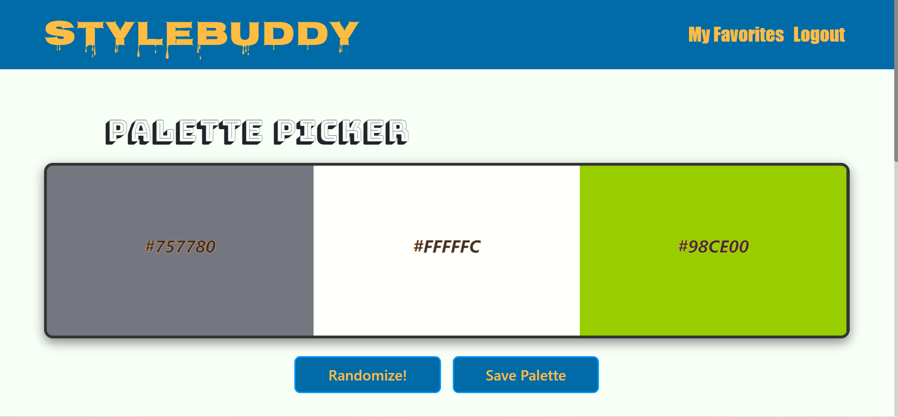
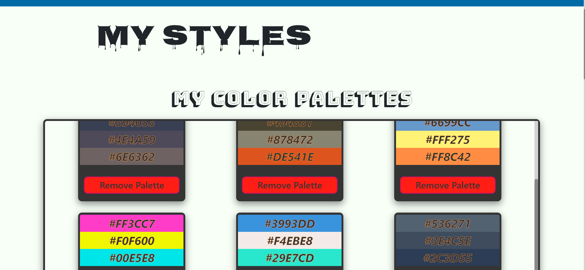
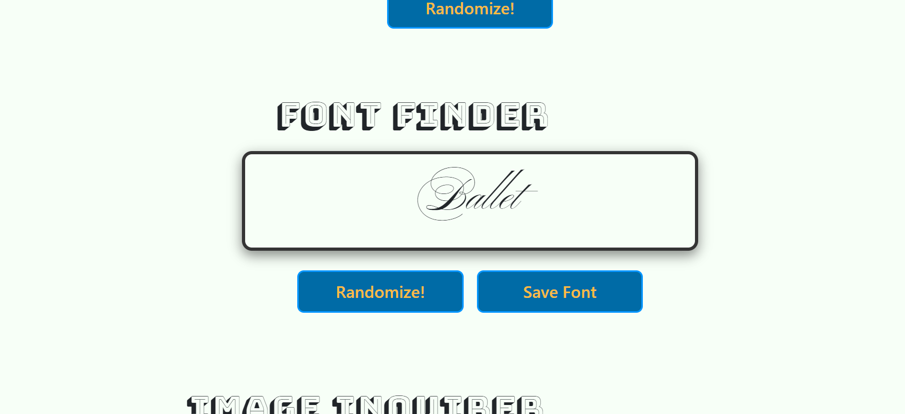
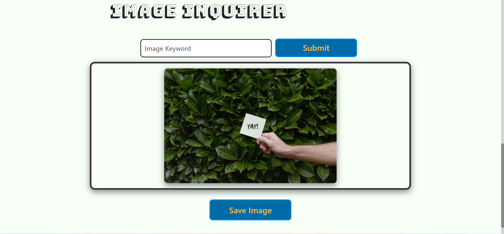
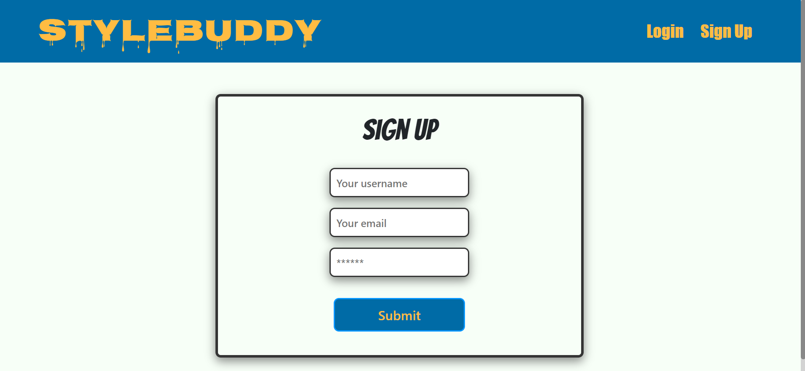

# Style-Buddy

## Table of Contents
[Description](#description) 
[Installation](#installation) 
[Usage](#usage) 
[Technologies Used](#technologies-used) 
[Credits](#credits) 

## Description
Style-buddy is a one-stop shop for developers who need styling ideas for their project. Style-buddy will provide an array of beautiful color palettes, randomized fonts from the Google Font API for inspiration, and a library of 1000s of stock images that are free to use. Users will be able to create an account for free and save images, color palettes, and fonts they like to their favorites page.

## Installation
No installation is required to use the application at the deployed website. To use and test the application locally, clone the code and run npm install in the command line in the root directory of the application to install teh dependancies. Once the dependancies are installed, run npm run develop from the command line in the root directory of the application to start the server and run the application locally. You can visit the local site in your browser at localhost:3000

## Usage
While on the homepage, the user can create an account or login using the "login" and "signup" buttons in the header along the top of the screen. Whether the user is logged in or not, they'll be able to search a stock image library, view randomized color palettes, and view randomized fonts. Once the user is logged in, they'll also see a save button for the three tools to be able to save their favorite images, fonts, and color palettes. To view their saved items, you can navigate to the 'My Favorites' page via the header. On the favorites page, the user will be able to see a list of all of their favorites. They'll also see a remove option for each category if they'd like to delete any of their saved items. While logged in the user will also see a logout option in the header.

You can visit the deployed version of the application here: [Style Buddy](https://protected-chamber-44327.herokuapp.com/).

## Technologies Used

* Javascript
* HTML
* CSS
* React
* MongoDB
* Apollo/GraphQL
* Express
* NodeJS
* JWT
* Bootstrap

## Credits
Style-Buddy is proudly created and maintained by Alex, Gestan, Kelsie, Olivia, and Sam.

* Alex's [GitHub profile](https://github.com/AlexCourtney18)
* Gestan's [GitHub profile](https://github.com/Gestan24)
* Kelsie's [GitHub profile](https://github.com/kidd93)
* Olivia's [GitHub profile](https://github.com/OliviaRamsfield)
* Sam's [GitHub profile](https://github.com/samvrny)

